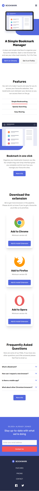

# Frontend Mentor - Bookmark landing page solution

This is a solution to the [Bookmark landing page challenge on Frontend Mentor](https://www.frontendmentor.io/challenges/bookmark-landing-page-5d0b588a9edda32581d29158). Frontend Mentor challenges help you improve your coding skills by building realistic projects.

## Table of contents

- [Overview](#overview)
  - [The challenge](#the-challenge)
  - [Screenshot](#screenshot)
  - [Links](#links)
- [My process](#my-process)
  - [Built with](#built-with)
  - [What I learned](#what-i-learned)
  - [Continued development](#continued-development)
  - [Useful resources](#useful-resources)
- [Author](#author)

## Overview

### The challenge

Users should be able to:

- View the optimal layout for the site depending on their device's screen size
- See hover states for all interactive elements on the page
- Receive an error message when the newsletter form is submitted if:
  - The input field is empty
  - The email address is not formatted correctly

### Screenshot





### Links

- Solution URL: https://github.com/DanKRT-Star/bookmark-landing-page-master
- Live Site URL: [Bookmark landing page](https://bookmark-landing-page-master-rho-five.vercel.app/)

## My process

### Built with

- Semantic HTML5 markup
- [Tailwind CSS](https://tailwindcss.com/) for utility-first styling
- Custom CSS layers for component states
- Mobile-first responsive design
- Vanilla JavaScript for interactivity (`script.js`)
- Flexbox and CSS Grid for layout

### What I learned

- **Responsive design:** Used Tailwind's responsive utilities to create layouts that adapt to different screen sizes.
- **Custom component states:** Leveraged Tailwind's `@layer` and custom classes for menu, FAQ, and form error states.
- **Form validation:** Implemented email validation and error display using JavaScript and Tailwind classes.
- **SVG manipulation:** Used SVGs for icons and logos, changing their fill and stroke via CSS and HTML.
- **Interactive UI:** Built tabbed features, FAQ accordion, and a mobile navigation menu with smooth transitions.
- **Style component by tailwind class:** using tailwind to style component directly in the class property.

Example: Style a component in HTML

```html
 <button id="emailSubmitBtn" type="submit" class="py-3 px-5 rounded-md w-full bg-primary-red text-neutral-50 border-solid border-2 border-primary-red md:w-fit hover:bg-neutral-50 hover:text-primary-red">Contact Us</button> 
```

Example: Email validation in JS

```js
const regex = /^[^\s@]+@[^\s@]+\.[^\s@]+$/;
if (regex.test(emailInput.value)) {
  // valid email
} else {
  // show error
}
```

### Continued development

- Improve accessibility (keyboard navigation, ARIA attributes)
- Add more robust form validation and feedback
- Enhance animation and transitions for a smoother UX
- Refactor JavaScript for better modularity

### Useful resources

- [Tailwind CSS Documentation](https://tailwindcss.com/docs)
- [MDN Web Docs - HTML, CSS, JS](https://developer.mozilla.org/)
- [Frontend Mentor Community](https://www.frontendmentor.io/community)

## Author

- Frontend Mentor - [@DanKRT-Star]https://www.frontendmentor.io/profile/DanKRT-Star
- Facebook - [Lê Mạnh Đan](https://www.facebook.com/le.manh.an.887330)
- Gmail - [Lê Mạnh Đan](tonyle1207@gmail.com)
- Github - [Lê Mạnh Đan](https://github.com/DanKRT-Star)

## Acknowledgments

Thanks to Frontend Mentor for providing this challenge and to the community for their helpful feedback and resources!

